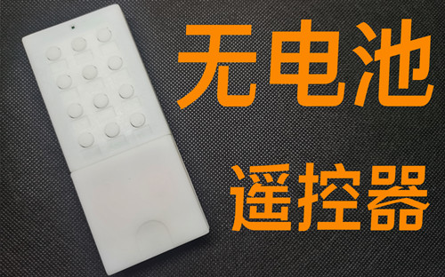

# 无电池遥控器

## 1 项目概述
由于普通遥控器的电池在使用一段时间后需要定期更换，我思索着有没有方法能做到***不换电池一直使用***。最终找到了通过按压发电模块作为电源的方法。本项目是该想法的一个具体实现。

## 2 功能介绍
### 2.1 使用前准备工作(操作一次即可)
* 通过Type-C线给遥控器供电
* 将无电池遥控器的信号接收口对准被录制遥控器的发射口
* 选中无电池遥控器的一个按钮，作为待录制按键，将其按下后松开
* 按下被录制遥控器的被录制按键
* 等待无电池遥控器学习完成，指示灯闪烁的次数对应使用前需要按压的次数
* 写下按键功能名字，贴到对应按键下方
### 2.2 基础使用方法
* 拿起无电池遥控器对准需要控制的设备(空调，电视等)
* 按压若干次按板(具体次数根据学习信号时的闪灯次数决定)
* 按下需要的功能按键，等待设备响应控制

## 3 基础原理解析
由于目前红外编解码缺乏统一的国际标准，因此不同厂商之间的红外标准会各不一样。但是从原理上来说就分为两种：

* 脉冲宽度调制(PWM)
* 脉冲位置调制(PPM)

由于实际测试不通遥控器的波形中发现不通厂商的红外信号定义和PPM以及PWM差别较大，因此采用一种通用的数据存储格式保存数据。具体格式细节见[这里](https://github.com/sidianneng/batteryless_remote/blob/main/doc/%E7%BA%A2%E5%A4%96%E8%A7%A3%E7%A0%81%E6%95%B0%E6%8D%AE%E4%BF%9D%E5%AD%98%E6%A0%BC%E5%BC%8F%E5%AE%9A%E4%B9%89.md)。
